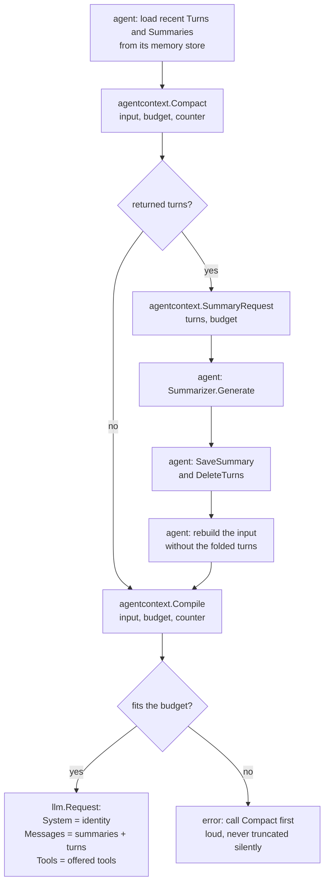

# Context window — who does what on each turn

This diagram shows one reasoning turn of `webtyp/agent`. The compiler (`agentcontext`) makes
decisions and builds the request. It never reads or writes memory and never calls a model.
The orchestrator (`agent`) does all the I/O. Boxes that start with **agentcontext** are pure
functions, and every other box is the orchestrator.

## The rules the functions apply

- **Order.** Turns and summaries are sorted by `CreatedAt`, oldest first, inside the
  compiler. The caller does not have to remember an order.
- **When to compact.** When the tokens used (system + tools + summaries + turns) exceed
  `CompactAt × (ContextTokens − OutputTokens)` and there are at least two turns.
- **What to compact.** The oldest half of the turns (at least one). The cut then moves forward
  while the first remaining turn is a tool result, so a tool result never ends up separated
  from the assistant message that asked for it.
- **Where summaries go.** Summaries go in one `RoleSystem` message at the start of `Messages`,
  not in `System`. `System` stays identical across turns, so a runtime can cache it.
